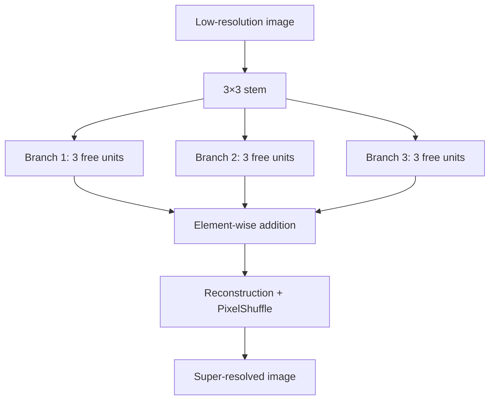

# BASS: Branching Architecture Search Space for Deep Super-Resolution

BASS is a TensorFlow/Keras search space for single-image super-resolution. It
keeps the original three-branch topology, repairs the runnable V1 baseline, and
adds a backward-compatible V2 genome in which every searchable unit can choose
either convolution or attention.

The design goal of V2 is **hybrid, free branches**: the branches do not receive
fixed roles such as “local”, “global”, or “hybrid”. Each of their three units is
searched independently, so evolution can discover homogeneous or mixed
branches.

## Architecture



All searchable operations preserve spatial size and channel count. This keeps
the branch addition valid without hidden projections and supports arbitrary
inference sizes. The reconstruction layer derives its channel count from the
requested scale, so `×2`, `×3`, and `×4` are supported correctly.

## Which attention is used?

BASS V2 deliberately does not use full global spatial self-attention. That
operation scales quadratically with the number of pixels and becomes expensive
at super-resolution feature-map sizes. Instead, the search space includes:

| Primitive | Context | Search argument | Purpose |
|---|---|---:|---|
| `channel_attention` | Global spatial pooling, channel gating | none | Cheap global channel context |
| `window_attention` | Local self-attention | window `4` or `8` | Texture and structure inside a window |
| `shifted_window_attention` | Shifted local self-attention | window `4` or `8` | Communication across window boundaries |
| `hybrid_conv_attention` | Depthwise convolution + window attention | window `4` or `8` | Local inductive bias and contextual mixing in one residual block |

Shifted attention applies both a region mask and a padding mask. Inputs whose
height or width is not divisible by the window are padded internally and cropped
back to the original size. Repeated hybrid blocks alternate regular and shifted
windows.

The CNN family remains available:

- standard convolution;
- dilated convolution with rates 2, 3, or 4;
- depthwise-separable convolution;
- expansion-2 inverted bottleneck;
- transposed convolution;
- identity.

## Versioned genomes

| Version | Length | Layout | Compatibility |
|---|---:|---|---|
| V1 | 84 bits | `3 channel bits + 9 × (op 3 + kernel 3 + repeat 3)` | Original CNN-only search space |
| V2 | 93 bits | `3 channel bits + 9 × (family 1 + op 3 + arg 3 + repeat 3)` | CNN + attention |

Both versions use Gray decoding for multi-bit fields. A canonical immutable
`ArchitectureSpec` is the boundary between the genome, model builder,
evaluation, and optimizer. Deterministic repair removes aliases such as repeated
identity blocks, and canonical JSON plus SHA-256 hashes make evaluation caching
reliable.

An old chromosome can be migrated without changing its network phenotype:

```python
from bass import encode_v2_bits, upgrade_v1

old_bits = [0] * 84
v2_spec = upgrade_v1(old_bits)
v2_bits = encode_v2_bits(v2_spec)
```

## Installation

Python 3.10 or newer is required.

```bash
git clone https://github.com/jesusllg/BASS-Branching-Architecture-Search-Space-for-Deep-Super-Resolution.git
cd BASS-Branching-Architecture-Search-Space-for-Deep-Super-Resolution
python -m venv .venv
source .venv/bin/activate
python -m pip install --upgrade pip
python -m pip install -e .
```

For tests:

```bash
python -m pip install -e ".[dev]"
python -m pytest
```

## Build an architecture

```python
import tensorflow as tf

from bass import sample_v2
from bass.model_builder import build_model

architecture = sample_v2(seed=42, attention_probability=0.5)
model = build_model(architecture, upscale_factor=4)

lr = tf.random.uniform((1, 31, 47, 3))
sr = model(lr, training=False)
assert sr.shape == (1, 124, 188, 3)
```

`build_model(..., return_feature_model=True)` also exposes exactly nine stable
feature taps—one after each searchable unit—for future zero-cost proxies.

## Run the repaired search

The command below runs the original V1 space with the deterministic SynFlow-style
baseline, parameter count, and FLOPs as minimization objectives:

```bash
bass-search --genome-version 1 --population 20 --generations 10
```

Search the hybrid V2 space with:

```bash
bass-search --genome-version 2 --population 20 --generations 10
```

For a quick CPU smoke test:

```bash
bass-search --genome-version 2 --population 4 --generations 1 \
  --input-size 16 --skip-flops
```

The repaired optimizer provides seeded initialization, tournament selection,
two-point crossover, bit mutation, non-dominated sorting, reference directions,
and NSGA-III niching. Real model evaluations are cached by canonical phenotype,
so different bit aliases do not rebuild the same network.

The historical launcher remains available:

```bash
python Implementation/main.py --genome-version 1 \
  --population 4 --generations 1 --input-size 16 --skip-flops
```

## Where the new V2 code lives

The installable implementation is under `src/bass/`. The files in
`Implementation/` are compatibility wrappers for scripts written against the
original repository; new development should target `src/bass/`.

| What you want to inspect or change | Location |
|---|---|
| Channel, window, shifted-window, and hybrid attention | `src/bass/blocks/attention.py` |
| V1/V2 genome decoding, V1 migration, and V2 sampling | `src/bass/encoding.py` |
| Canonical architecture and block representation | `src/bass/genotype.py` |
| Deterministic genotype canonicalization | `src/bass/repair.py` |
| CNN/attention operation registry | `src/bass/registry.py` |
| Three-branch network, feature taps, and PixelShuffle | `src/bass/model_builder.py` |
| SynFlow-style baseline, PSNR/SSIM, parameters, and FLOPs | `src/bass/evaluation.py` |
| Cached multi-objective problem | `src/bass/problem.py` |
| Repaired NSGA-III search | `src/bass/nsga3.py` |
| Command-line entry point | `src/bass/cli.py` |
| V1 compatibility entry points | `Implementation/` |
| Regression and V2 behavior tests | `tests/` |

The shortest reading path is: `genotype.py` → `encoding.py` → `registry.py` →
`model_builder.py`. For attention internals, go directly to
`blocks/attention.py`; for running a search, start at `cli.py`.

## Evaluation API

`evaluate_architecture` returns the quality score, parameters, FLOPs, and metric
metadata. The search minimizes `[-score, parameters, FLOPs]`.

```python
from bass import sample_v2
from bass.evaluation import evaluate_architecture

result = evaluate_architecture(
    sample_v2(seed=7),
    metric="synflow",
    input_shape=(32, 32, 3),
)
print(result.score, result.params, result.flops)
```

PSNR evaluation is also supported through the Python API when both training and
validation datasets are supplied. Images are expected in `[0, 1]`.

## Project layout

```text
src/bass/
├── blocks/attention.py   # channel, window, shifted, and hybrid attention
├── encoding.py           # V1/V2 codecs and migration
├── evaluation.py         # SynFlow-style baseline, PSNR, SSIM, params, FLOPs
├── genotype.py           # canonical architecture schema
├── model_builder.py      # three-branch Keras model
├── nsga3.py              # repaired multi-objective optimizer
├── problem.py            # cached search-problem adapter
├── registry.py           # operation-to-layer registry
└── repair.py             # deterministic canonical repair

Implementation/           # compatibility entry points for the original layout
tests/                    # codec, model, serialization, gradient, and optimizer tests
```

## Current scope

- SynFlow-style gradient flow is a stable baseline, not an implementation of
  AZ-NAS/AZ-SR.
- FLOPs are profiled for the input shape supplied to the evaluator.
- Dataset loading and benchmark training recipes are intentionally not hard-coded;
  PSNR experiments must provide explicit `tf.data.Dataset` objects.
- The repository implements the search space and optimizer plumbing; it does not
  ship pretrained models or claim benchmark results.

Pull requests should include tests for changes to codecs, tensor shapes,
serialization, or search behavior.
