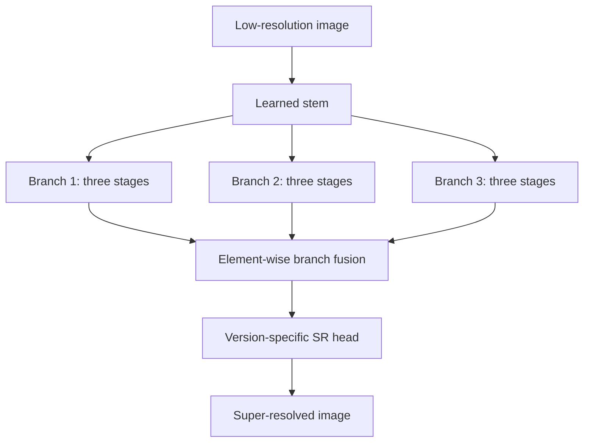
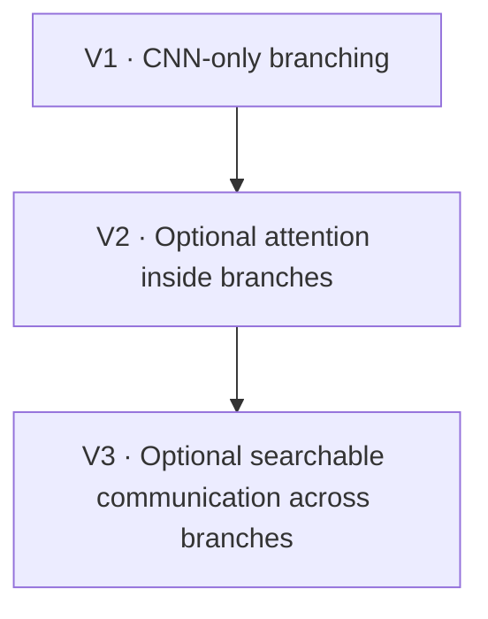

# BASS: Branching Architecture Search Space for Deep Super-Resolution

BASS is a research repository for studying **branching neural architecture
search (NAS) for single-image super-resolution (SISR)**. Its central question
is not whether one hand-designed block wins in isolation, but which
combinations of operations, depths, and branch interactions produce useful
quality–efficiency trade-offs.

The repository keeps three BASS contracts side by side. V1 is the frozen
CNN-only baseline, V2 searches optional attention inside otherwise independent
branches, and V3 (IBASS) searches optional compact communication across those
branches. All three runtime contracts are separate; V2 and V3 remain gated
from publication-scale NAS claims until their empirical validation is complete.

The original BASS search space accompanies:

> J. L. Llano García, R. Monroy, V. A. Sosa Hernández, and K. Deb,
> “Beyond Performance: Designing a Super-Resolution Architecture Search Space
> and a Hybrid Multi-Objective Approach for Neural Architecture Optimization,”
> *IEEE Access*, vol. 13, pp. 107187–107203, 2025.
> [doi:10.1109/ACCESS.2025.3581919](https://doi.org/10.1109/ACCESS.2025.3581919)

## The BASS research idea

Every BASS version preserves the same identity-defining macro-architecture:
a learned stem feeds three parallel branches; each branch contains three
ordered searchable stages; the branch outputs are fused by element-wise
addition; and a version-specific reconstruction head produces the SR image.
Branches have no manually assigned “local,” “global,” or “hybrid” role.
Their roles emerge from the searched architecture.



The versions extend that premise without silently changing earlier
experimental contracts:



## Choose the research contract

| Version | Research question | Searchable node space | Branch interaction | Scientific genome | SR head | Runtime status |
|---|---|---|---|---:|---|---|
| [BASS V1](docs/versions/v1/README.md) | What can the original CNN-only branching space express? | Eight CNN/identity primitives | Final addition only | 84 Gray-coded bits | Direct PixelShuffle head with sigmoid output | **Implemented; frozen baseline** |
| [BASS V2](docs/versions/v2/README.md) | Should each unit use convolution, attention, or skip? | Seven residual CNN and seven residual attention configurations, plus skip | Final addition only | 10 canonical semantic integers | Learned residual over bicubic LR | **Implemented; experiment-gated** |
| [BASS V3](docs/versions/v3/README.md) | Should branches exchange compact information while remaining diverse? | V2-compatible units plus optional CIMEX exchange genes | Searchable exchange after stages 1 and 2 | 12 canonical semantic integers | Exact V2 residual head | **Implemented; experiment-gated** |

Important distinctions:

- V2 attention is optional at every unit; there is no forced attention branch.
- V2 is not a phenotype-preserving rewrite of V1. It is a separate, audited
  search contract with residual primitives and a different reconstruction head.
- V3 is a released research runtime, not a benchmark result. Its exchange genes
  include `none`; with `none/none`, the builder delegates to the exact V2 graph.
- The default V2/V3 optimizer initializer samples complete canonical
  architectures directly. Family-conditioned `sample(...)` helpers are for
  construction and validation strata, not the default scientific prior.

The full software boundary is defined in
[`docs/VERSIONS.md`](docs/VERSIONS.md). Each version README contains its own
architecture map, search-space definition, limitations, and implementation
status.

## Install

Python 3.10 or newer is required.

```bash
git clone https://github.com/jesusllg/BASS-Branching-Architecture-Search-Space-for-Deep-Super-Resolution.git
cd BASS-Branching-Architecture-Search-Space-for-Deep-Super-Resolution
python -m venv .venv
source .venv/bin/activate
python -m pip install --upgrade pip
python -m pip install -e .
```

For development:

```bash
python -m pip install -e ".[dev]"
python -m pytest
ruff check .
ruff format --check .
```

## Build an architecture

### V1: frozen CNN-only baseline

```python
import tensorflow as tf

from bass import v1

architecture = v1.decode([0] * 84)
model = v1.build_model(architecture, upscale_factor=2)
sr = model(tf.zeros((1, 16, 16, 3)), training=False)
assert sr.shape == (1, 32, 32, 3)
```

### V2: optional attention

```python
import tensorflow as tf

from bass import v2

architecture = v2.sample(seed=42, attention_probability=0.5)
model = v2.build_model(architecture, upscale_factor=4)
sr = model(tf.random.uniform((1, 31, 47, 3)), training=False)
assert sr.shape == (1, 124, 188, 3)
```

Set `attention_probability=0.0` to sample a CNN-only V2 phenotype or `1.0`
to sample attention in every active unit. This argument controls random
sampling; the NAS representation itself permits free mixtures.

### V3: interaction-aware BASS with CIMEX

```python
import tensorflow as tf

from bass import v3

architecture = v3.sample(
    seed=42,
    attention_probability=0.5,
    exchange_probability=1.0,
)
model = v3.build_model(architecture, upscale_factor=2)
sr = model(tf.random.uniform((1, 31, 47, 3)), training=False)
assert sr.shape == (1, 62, 94, 3)
```

The example deliberately enables CIMEX for inspection. NAS initialization uses
`v3.sample_canonical_genome()` and is uniform over complete canonical V3
architectures unless a conditioned exchange prior is explicitly requested.

## Run a search

Select the scientific contract explicitly:

```bash
# BASS V1: frozen 84-bit CNN-only space
bass-search --genome-version 1 --population 20 --generations 10

# BASS V2: canonical optional-attention space
bass-search --genome-version 2 --population 20 --generations 10

# BASS V3: canonical IBASS+CIMEX space
bass-search --genome-version 3 --population 20 --generations 10
```

For a small CPU smoke test:

```bash
bass-search --genome-version 2 --population 4 --generations 1 \
  --input-size 16 --skip-flops
```

The historical `Implementation/` entry point is V1-only. It cannot be used to
launch V2 or V3 implicitly.

## What is scientifically ready?

The repository provides search-space definitions, model builders, evaluators,
and reference multi-objective search plumbing. It does **not** currently ship
pretrained models, a fixed benchmark-training recipe, or a claim that V2/V3
already exceeds the SISR state of the art.

- V1 is retained for exact baseline reproduction and compatibility work.
- V2 has strict codecs, canonical duplicate handling, shape/gradient tests,
  and executable audit harnesses. Full NAS claims remain gated on proxy
  calibration and short-training rank validation; see
  [`docs/V2_AUDIT_RESPONSE.md`](docs/V2_AUDIT_RESPONSE.md).
- V3 has a strict codec, exact V2 boundary, CIMEX implementation, canonical
  search operators, tensor/gradient/equivariance/save-load tests, and audit
  harnesses. It still requires cost profiling, proxy calibration, ablations,
  and standard SISR training; see its
  [version README](docs/versions/v3/README.md).

The independent Round-2 audit is reconciled issue by issue in
[`docs/ROUND2_AUDIT_RESPONSE.md`](docs/ROUND2_AUDIT_RESPONSE.md). Its current
conclusion is intentionally nuanced: runtime implementation is ready for
experiments, but **GO FOR FULL NAS remains gated**.

The search minimizes `[-score, parameters, FLOPs]`. The bundled V2 proxy is
named `gradient_flow`; it is not presented as canonical SynFlow or AZ-NAS.
PSNR evaluation is available when training and validation `tf.data.Dataset`
objects are supplied.

## Repository map

| Location | Purpose |
|---|---|
| [`docs/versions/v1/`](docs/versions/v1/README.md) | V1 architecture map and frozen contract |
| [`docs/versions/v2/`](docs/versions/v2/README.md) | V2 architecture map and optional-attention contract |
| [`docs/versions/v3/`](docs/versions/v3/README.md) | V3 IBASS+CIMEX architecture, usage, novelty boundary, and gates |
| [`src/bass/v1/`](src/bass/v1/) | Independent V1 implementation |
| [`src/bass/v2/`](src/bass/v2/) | Independent V2 implementation, including attention blocks |
| [`src/bass/v3/`](src/bass/v3/) | Independent V3 implementation, including CIMEX exchange |
| [`src/bass/shared/`](src/bass/shared/) | Version-neutral evolutionary search machinery |
| [`src/bass/cli.py`](src/bass/cli.py) | Explicit V1/V2/V3 CLI routing |
| [`Implementation/`](Implementation/) | Historical V1-only compatibility interface |
| [`tests/`](tests/) | Version boundaries, codecs, models, and search behavior |
| [`scripts/`](scripts/) | Large structural and executable validation gates |

For V1, the shortest code-reading path is `genotype.py` → `encoding.py` →
`registry.py` → `model_builder.py` under `src/bass/v1/`. Follow the same path
for V2, then inspect `src/bass/v2/blocks/attention.py`. For V3, continue with
`src/bass/v3/blocks/cimex.py` and `src/bass/v3/model_builder.py`.

## Citation

```bibtex
@article{llanogarcia2025bass,
  author  = {Llano Garc\'{i}a, Jes\'{u}s L. and Monroy, Ra\'{u}l and
             Sosa Hern\'{a}ndez, V\'{i}ctor A. and Deb, Kalyanmoy},
  title   = {Beyond Performance: Designing a Super-Resolution Architecture
             Search Space and a Hybrid Multi-Objective Approach for Neural
             Architecture Optimization},
  journal = {IEEE Access},
  volume  = {13},
  pages   = {107187--107203},
  year    = {2025},
  doi     = {10.1109/ACCESS.2025.3581919}
}
```

## Contributing

Changes must respect the version boundary in
[`docs/VERSIONS.md`](docs/VERSIONS.md). Pull requests should include tests for
every affected codec, tensor shape, serialization path, version boundary, or
search behavior. Do not label an architectural proposal as implemented or
validated until the corresponding code and experimental gates exist.
