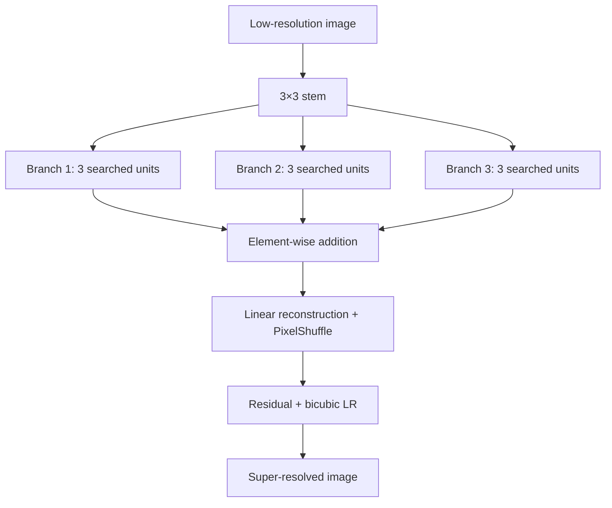

# BASS: Branching Architecture Search Space for Deep Super-Resolution

BASS now contains two deliberately separate search spaces in the same package:

| Version | Python namespace | Genome | Searchable units | Status |
|---|---|---:|---|---|
| BASS V1 | `bass.v1` | 84 bits | CNN only | Frozen, repaired baseline |
| BASS V2 | `bass.v2` | 10 semantic integers | CNN or attention per unit | Structurally audited; experiments gated |

V1 does not import V2 or any attention implementation. V2 owns its genotype,
codec, repair rules, registry, model builder, evaluator, and optimization
problem. Shared search machinery lives in `bass.shared`. See
[`docs/VERSIONS.md`](docs/VERSIONS.md) for the boundary and
[`docs/V2_AUDIT_RESPONSE.md`](docs/V2_AUDIT_RESPONSE.md) for the scientific
readiness decision.

## The architecture decision

Both versions keep the original macro-topology: three parallel branches with
three searchable units per branch. The branches are not assigned fixed
"local", "global", or "hybrid" roles.



In V1 every unit is convolutional. In V2 each of the nine slots independently
chooses skip or one of 14 complete primitive configurations. Seven are residual
CNN configurations and seven are residual attention configurations. Attention
is optional, and the branches have no predetermined local/global roles.

V2 avoids full global spatial self-attention because its cost is quadratic in
the number of pixels. It searches these alternatives:

| V2 primitive | Context | Search argument |
|---|---|---:|
| `channel_attention_residual` | Global pooling gates a signed residual delta | none |
| `window_transformer` | Local self-attention with convolutional position encoding | window 4 or 8 |
| `regular_shifted_pair` | Guaranteed regular/shifted cross-window exchange | window 4 or 8 |
| `hybrid_conv_window` | Depthwise local path plus window attention | window 4 or 8 |

Shifted windows include region and padding masks. Non-divisible inputs are
padded internally and cropped back.

## Install

Python 3.10 or newer is required.

```bash
git clone https://github.com/jesusllg/BASS-Branching-Architecture-Search-Space-for-Deep-Super-Resolution.git
cd BASS-Branching-Architecture-Search-Space-for-Deep-Super-Resolution
python -m venv .venv
source .venv/bin/activate
python -m pip install --upgrade pip
python -m pip install -e .
```

For development:

```bash
python -m pip install -e ".[dev]"
python -m pytest
ruff check .
ruff format --check .
```

## Use V1 without attention

```python
import tensorflow as tf

from bass import v1

architecture = v1.decode([0] * 84)
model = v1.build_model(architecture, upscale_factor=2)
sr = model(tf.zeros((1, 16, 16, 3)), training=False)
assert sr.shape == (1, 32, 32, 3)
```

This path stays entirely inside `src/bass/v1/`.

## Use V2 with optional attention

```python
import tensorflow as tf

from bass import v2

architecture = v2.sample(seed=42, attention_probability=0.5)
model = v2.build_model(architecture, upscale_factor=4)
sr = model(tf.random.uniform((1, 31, 47, 3)), training=False)
assert sr.shape == (1, 124, 188, 3)
```

Set `attention_probability=0.0` for a CNN-only V2 sample, `1.0` for an
attention-only sample, or an intermediate value for free mixtures. During NAS,
the optimizer stores one channel ID plus nine complete state IDs. Skips are
packed, equivalent repeat groupings are normalized, and the three symmetric
branches are sorted before an individual can enter the population.

`build_model(..., return_feature_model=True)` exposes nine stable feature taps,
one after each searchable unit, in both versions.

## Run the search

Use the same CLI with an explicit version:

```bash
# Frozen 84-bit CNN-only space
bass-search --genome-version 1 --population 20 --generations 10

# Canonical semantic optional-attention space
bass-search --genome-version 2 --population 20 --generations 10
```

For a quick CPU smoke test:

```bash
bass-search --genome-version 2 --population 4 --generations 1 \
  --input-size 16 --skip-flops
```

V2 crosses complete branches and mutates complete semantic states. Duplicate
canonical hashes are rejected rather than occupying population slots. The
bundled algorithm is named `ReferenceDirectionEA`: it now uses Deb-Jain
ideal/extreme/intercept normalization, but is not presented as externally
validated NSGA-III until cross-validation is completed. Per-generation and
cumulative duplicate rejection counts are exposed through `optimizer.history`.

The historical entry point is intentionally V1-only:

```bash
python Implementation/main.py --population 4 --generations 1 \
  --input-size 16 --skip-flops
```

`Implementation/` rejects V2 so old code cannot silently start searching a
different space.

## Migrate a V1 architecture to V2

Migration is explicit and one-way. It preserves CNN-only status but is not
phenotype-exact because the audited V2 catalog intentionally replaces V1
operations with residual, cost-controlled counterparts:

```python
from bass import v1, v2

v1_spec = v1.decode([0] * 84)
v2_spec = v2.migrate_v1(v1_spec)
v2_genome = v2.encode(v2_spec)

assert v2_spec.schema_version == 2
assert v2_spec.attention_fraction == 0.0
assert len(v2_genome) == 10
```

Use V1 itself when exact V1 behavior is required. The retired 93-bit V2
prototype remains inspectable through `bass.v2.legacy93`, but it is not a
scientific optimizer input.

## Where everything lives

| Area | Location | Responsibility |
|---|---|---|
| V1 baseline | `src/bass/v1/` | Frozen CNN config, 84-bit codec, model, evaluation, problem |
| V2 hybrid | `src/bass/v2/` | Semantic codec, strict schema, residual operations, model, evaluation, problem |
| Retired V2 format | `src/bass/v2/legacy93.py` | Import/export only; never scientific search |
| V2 blocks | `src/bass/v2/blocks/` | Residual CNN, channel, window, paired-shift, and hybrid blocks |
| Shared optimizer | `src/bass/shared/nsga3.py` | Reference-direction EA with semantic hooks |
| CLI routing | `src/bass/cli.py` | Selects V1 or V2 explicitly |
| Compatibility facades | `src/bass/*.py` | Keeps imports from BASS 0.2 working |
| Original layout | `Implementation/` | V1-only wrappers for historical scripts |
| Version boundary tests | `tests/v1/`, `tests/v2/`, `tests/shared/` | Isolation, strict codecs, migration, routing |

```text
src/bass/
├── v1/                     # independent CNN-only BASS
│   ├── config.py
│   ├── encoding.py
│   ├── genotype.py
│   ├── registry.py
│   ├── model_builder.py
│   ├── evaluation.py
│   └── problem.py
├── v2/                     # independent optional-attention BASS
│   ├── blocks/attention.py
│   ├── blocks/cnn.py
│   ├── config.py
│   ├── encoding.py
│   ├── genotype.py
│   ├── legacy93.py
│   ├── repair.py
│   ├── registry.py
│   ├── model_builder.py
│   ├── evaluation.py
│   └── problem.py
├── shared/nsga3.py         # version-neutral search engine
├── cli.py                  # explicit version selector
└── *.py                    # backward-compatible import facades

Implementation/             # historical BASS V1 interface only
tests/v1/                   # V1 isolation and contract tests
tests/v2/                   # V2 attention and migration tests
tests/shared/               # routing and shared infrastructure tests
scripts/                    # 10k structural and 500-model validation gates
```

The shortest V1 reading path is `v1/genotype.py` → `v1/encoding.py` →
`v1/registry.py` → `v1/model_builder.py`. For V2, follow the same path under
`v2/` and then inspect `v2/blocks/attention.py`.

## Evaluation API

Each version exposes its own evaluator. The search minimizes
`[-score, parameters, FLOPs]`.

```python
from bass import v2
from bass.v2.evaluation import evaluate_architecture

result = evaluate_architecture(
    v2.sample(seed=7),
    metric="gradient_flow",
    input_shape=(32, 32, 3),
)
print(result.score, result.params, result.flops)
```

PSNR evaluation is available when training and validation `tf.data.Dataset`
objects are supplied. Images are expected in `[0, 1]`.

## Current scope

- V2 calls its bundled proxy `gradient_flow`; it is not canonical SynFlow or
  AZ-NAS/AZ-SR, and disconnected/non-finite gradients fail explicitly.
- Full NAS remains gated on family-balanced proxy calibration and short-training
  rank validation; executable code is not treated as scientific validation.
- FLOPs are profiled for the evaluator's supplied input shape.
- Dataset loading and benchmark training recipes are not hard-coded.
- The repository contains search spaces and optimizer plumbing, not pretrained
  models or benchmark claims.

Run the implemented structural and executable audit harnesses explicitly:

```bash
python scripts/audit_v2_space.py --samples 10000 \
  --output v2-structural-audit.json
python scripts/validate_v2_models.py --samples 500 \
  --output v2-executable-validation.json
```

The second command is intentionally outside the ordinary unit suite because it
builds and differentiates 500 family-stratified models. Passing it still does
not replace proxy calibration or short-training PSNR rank validation.

Pull requests should include tests for codecs, tensor shapes, serialization,
version boundaries, or search behavior affected by the change.
