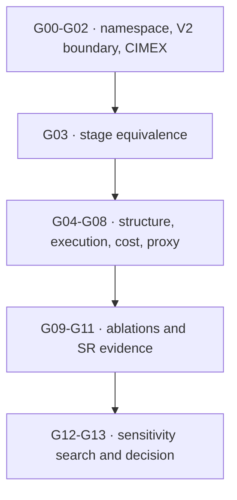

# Round 3 audit response: stage-aware V3 and evidence integrity

This response addresses the 54-page full re-audit of `main` at
`d1b624feb98d28caaf439d0d2ee9d919fede2516`. We accept the audit's critical
V3 counterexample. We do not convert every recommendation into code merely
because it appears in the report: implementation defects are fixed, empirical
questions become frozen gates, and recommendations that weaken the state model
are replaced with stricter alternatives.

## Current verdict

| Contract | Runtime verdict | Empirical verdict |
|---|---|---|
| BASS V1 | Frozen; unchanged | Historical baseline only |
| BASS V2 | Runtime unchanged and executable | **0/14 qualifying gates; NO-GO for empirical/SoTA claims** |
| BASS V3 | Critical stage-boundary defect fixed in `interaction-semantic-v2` | **0/14 qualifying gates; NO-GO for empirical/SoTA claims** |

The V3 fix removes the audit's representation-level blocker. It does not turn
unexecuted GPU experiments into evidence. Definitive V3 NAS starts only after
the stage-equivalence gate qualifies on the frozen runtime.

## Issue dispositions

The status `DEFINED_NOT_RUN` means that the required cohort, hardware,
artifacts, and decision rule exist, but no qualifying measurement is claimed.

| ID | Disposition | What changed or remains required |
|---|---|---|
| R3-001 | **Fixed in runtime** | V3 no longer calls V2 whole-branch canonicalization. Enabled CIMEX sites are hard barriers for skip packing and repeat merging. Exchange removal and branch normalization reach a joint fixed point. |
| R3-014 | **Fixed in runtime/docs** | Stage-aware catalogs and exact cardinality were recomputed; the prior number is retired. |
| R3-002 | **Accepted as bias; runtime deliberately unchanged** | Uniform V2 architectures are not uniform in depth/cost. V2-G11 now compares canonical-uniform, depth-stratified, cost-stratified, and preregistered skip-rate initialization with common seeds. |
| R3-003 | **Recomputed; empirical sensitivity defined** | The corrected complete-architecture V3 prior is still CIMEX-heavy. V3-G12 compares canonical-uniform, exchange-neutral, complexity-stratified, and exchange-mutation sensitivity conditions. |
| R3-004 | **DEFINED_NOT_RUN** | V2/V3 compute and target-memory gates require traced FLOPs, synchronized latency, peak memory, and retained failures on declared hardware. Categorical balance is never called computational fairness. |
| R3-005 | **Open empirical dependency** | No synthetic “AZ score” was invented. Proxy plans must be frozen, individually calibrated against held-out short training, and only then may a conditional aggregate be evaluated. |
| R3-006 | **DEFINED_NOT_RUN** | The 500-model executable gates remain hardware hand-offs. Local smoke coverage is not promoted to a qualifying result. |
| R3-007 | **DEFINED_NOT_RUN** | CIMEX mechanism and placement gates now include matched-cost no-exchange, simpler mean/1x1 and concatenation/1x1 controls, local/window attention, centering, read-source, sharing, gate, prototype, and site ablations. |
| R3-008 | **Declared design choice; sensitivity defined** | Released `0.60/0.40` prototype-change/delete weights remain explicit. V3-G12 requires a one-factor exchange-neutral mutation comparison. |
| R3-009 | **DEFINED_NOT_RUN** | `ReferenceDirectionEA` retains that conservative name. V2-G12 and V3-G12 require comparison with an independent maintained implementation before an NSGA-III equivalence claim. |
| R3-010 | **DEFINED_NOT_RUN** | Target-device inference and optimizer-step peak-memory gates retain OOMs as data. |
| R3-011 | **Not an implementation bug; ablation required** | Centered CIMEX deliberately forbids a common-mode update. Stage A compares centered and uncentered corrections; no benefit is presumed. |
| R3-012 | **DEFINED_NOT_RUN** | V2-G10 isolates residual versus direct SR heads under paired seeds and training. |
| R3-013 | **Open until execution** | Gate work orders require a frozen recipe/dataset/environment identity and raw per-seed results; the repository does not fabricate a universal SISR recipe. |
| R3-EXP-001 | **Fixed in tooling** | Schema validation and evidence verification are separate. Evidence verification validates the work order, hardware minima, timestamps, artifact existence/containment, and SHA-256 computed from bytes. |
| R3-EXP-002 | **Inconsistency fixed; proposed `SKIP` result status rejected** | An experiment that did not run has no result envelope. `JUSTIFIED_SKIP` exists only as a signed final-ledger disposition for a protocol-declared conditional gate. Mandatory gates cannot use it. |
| R3-EXP-003 | **Fixed in contract** | Git checkout identity, version-specific runtime-tree SHA-256, and protocol digest are separate. `audit_base_revision` is provenance only; runtime compatibility is enforced by exact tree content. |
| R3-EXP-004 | **Gate added; DEFINED_NOT_RUN** | New V3-G03 sits before structural/model/search gates and requires exhaustive barrier-segment traces plus 256 raw-versus-canonical numerical graph pairs. |
| R3-EXP-005 | **Accepted scope boundary** | The package is described as protocol preparation and result-contract tooling. Cluster runners remain explicit laboratory adapters, not code claimed to exist here. |

## Critical V3 correction

### Why the audit was right

With CIMEX after Stage 1, these are different graphs:

```text
[skip, A, skip]  =>  stem -> CIMEX -> A
[A, skip, skip]  =>  stem -> A -> CIMEX
```

V2 could pack the first sequence into the second because its stage boundaries
contain no operation. In V3 the enabled exchange changes the tensor consumed by
`A`; moving `A` across it is not an equivalence. The same failure occurs when
`A×1 | CIMEX | A×2` is merged into `A×3 | CIMEX`.

### Corrected rule

For each complete branch, V3 now:

1. partitions its three stages at every enabled exchange;
2. removes skips and merges adjacent identical repeats only inside each
   partition;
3. preserves the expanded operation trace in every partition;
4. quotients only permutations of complete branches, which remains valid
   because CIMEX projections and reductions are branch-permutation equivariant;
5. removes an exchange only after stage-aware normalization proves that no
   downstream branch transform can make its centered correction observable;
6. repeats normalization/removal to a fixed point.

A `none` exchange is not a semantic barrier, so safe compression across it
remains legal and the V2 `none/none` subspace stays exact.

The codec identifier is now `interaction-semantic-v2`. Persisted
`interaction-semantic-v1` objects are rejected rather than silently relabeled:
the old quotient may already have lost the original stage position, so a
general faithful migration is impossible.

Implementation and regression evidence live in:

- [`src/bass/v3/genotype.py`](../src/bass/v3/genotype.py)
- [`src/bass/v3/encoding.py`](../src/bass/v3/encoding.py)
- [`tests/v3/test_namespace.py`](../tests/v3/test_namespace.py)
- [`scripts/audit_v3_stage_equivalence.py`](../scripts/audit_v3_stage_equivalence.py)

The preflight exhaustively checks all `43^3` raw one-branch grids under all four
enabled-barrier masks. This structural proof is intentionally not substituted
for V3-G03's still-pending numerical raw-graph comparison on qualifying
hardware.

## Corrected cardinality and prior

Enabled barriers change the legal branch equivalence relation, so V3 now builds
four separate canonical branch catalogs:

| Exchange barrier mask | Canonical branch states |
|---|---:|
| `none / none` | 68,923 |
| `CIMEX / none` | 74,089 |
| `none / CIMEX` | 74,089 |
| `CIMEX / CIMEX` | 79,507 |

For each of the nine concrete exchange configurations (`none`, `k8`, `k16` at
two sites), the implementation counts unordered multisets of three branches,
excludes only algebraically inactive exchange cases, and multiplies by four
widths. The exact corrected total is:

\[
|\mathcal{A}_{V3}| = 2{,}643{,}101{,}795{,}040{,}984.
\]

The default sampler first weights exchange configurations by these exact
counts, samples a branch multiset uniformly within that configuration, and
chooses width uniformly. Therefore every complete canonical architecture has
the same probability.

That property is not mechanism neutrality:

| Enabled sites | Exact architectures | Complete-canonical prior |
|---:|---:|---:|
| 0 | 218,283,124,749,400 | 8.2586% |
| 1 | 1,084,538,018,126,640 | 41.0328% |
| 2 | 1,340,280,652,164,944 | 50.7086% |

So `P(any CIMEX) = 91.7414%` and the expected enabled-site count is about
`1.4245/2`. We report that bias rather than laundering “uniform architecture”
into “fair mechanism exposure.” An explicit numeric `exchange_probability`
selects the declared hierarchical prior instead.

## Experimental chain of custody

Protocol schema 2 replaces ambiguous `base_revision` semantics with three
separate bindings:

| Binding | Meaning | Enforcement |
|---|---|---|
| `source_revision` | Complete clean Git checkout | Captured in each work order/result |
| `runtime_tree_sha256` | Exact files that implement V2 or V3 | Recomputed when preparing work; must match the frozen protocol |
| `protocol_digest` | Gate definitions, cohort, dependencies, artifacts, and criteria | Recomputed from canonical protocol JSON |

`bass-gates validate-result` is schema/manifest validation. Publication
authorization must use `bass-gates verify-result`, which follows the work order
and recomputes local artifact hashes from bytes. Remote URIs do not pass without
an explicit resolver supplied by the execution environment.

The final ledger is a different object from an execution result. A `GO`
decision requires byte-verified `PASS` results for every mandatory gate. Only a
conditional gate may have `JUSTIFIED_SKIP`, with no fake result digest and with
a signed justification.

## Gate order after remediation

V3 now contains 14 gates, `V3-G00` through `V3-G13`. The critical dependency is:



The current ledger remains `0/14`. The protocols define what must run on the
appropriate CPU/GPU/target hardware; they do not claim those runs happened.

## Bottom line

The audit found a real scientific representation bug, and V3 was not sound
until it was fixed. The corrected implementation preserves the essence of BASS:
three symmetric searched branches, three ordered searchable stages, and final
additive fusion, now extended by optional interaction whose placement remains a
genuine search variable.

CIMEX is still a hypothesis, not a trophy. V3 earns a research claim only if
the frozen matched-cost, prior-sensitivity, proxy, memory, SR, and multi-seed
gates produce verified evidence. Until then the honest label is: **runtime
implemented, empirical authorization pending**.
