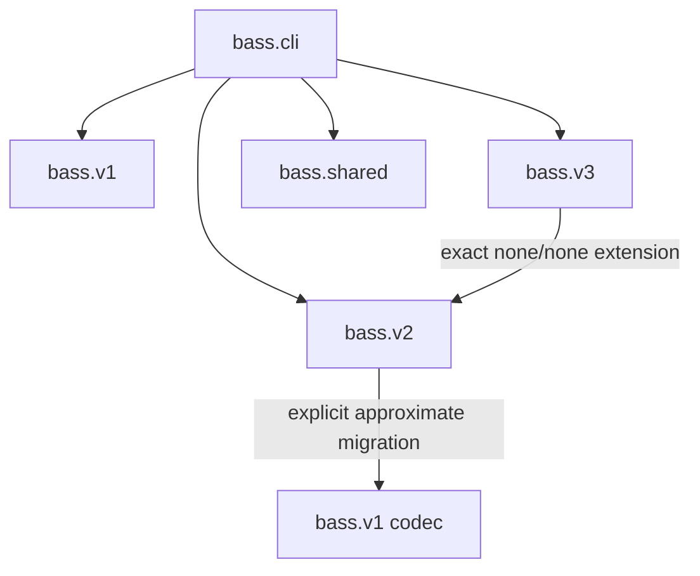

# BASS version boundaries

This document is the source of truth for keeping BASS V1, V2, and V3 distinct
inside one research repository. Each version has its own architecture map,
schema, implementation, and scientific limitations:

- [BASS V1: frozen CNN-only baseline](versions/v1/README.md)
- [BASS V2: optional-attention search space](versions/v2/README.md)
- [BASS V3: IBASS with optional CIMEX exchange](versions/v3/README.md)

## Contract matrix

| Contract | V1 | V2 | V3 |
|---|---|---|---|
| Runtime status | Implemented and frozen | Implemented; experiment-gated | **Stage-aware implementation; experiment-gated** |
| Namespace | `bass.v1` | `bass.v2` | `bass.v3` |
| CLI selector | `--genome-version 1` | `--genome-version 2` | `--genome-version 3` |
| Schema version | 1 | 2 | 3 |
| Scientific genome | 84 binary bits | 10 canonical semantic integers | 12 canonical semantic integers |
| Retired import format | None | 93 bits via `bass.v2.legacy93` | None |
| Macro-topology | 3 branches × 3 units | 3 branches × 3 units | 3 branches × 3 units plus two optional exchange sites |
| Unit families | CNN/identity | Skip, residual CNN, residual attention | V2-compatible units |
| Cross-branch communication | Final addition only | Final addition only | Searchable CIMEX after stages 1 and 2 |
| Canonicalization | V1 decode contract | Skip/repeat normalization and branch sorting | Joint stage/exchange normalization; enabled exchanges are hard barriers |
| Optimization problem | `bass.v1.problem.BASSProblem` | `bass.v2.problem.BASSProblem` | `bass.v3.problem.BASSProblem` |

## Dependency direction



Rules:

1. `bass.v1` must never import V2, V3, or attention code.
2. `bass.v2` owns its implemented unit-attention catalog. Its only V1
   dependency is the explicit migration path in `bass.v2.encoding`.
3. `bass.v3` may reuse V2's frozen unit contract and exact no-exchange builder;
   V2 must never import V3.
4. `bass.shared` must not know any versioned genotype schema.
5. `Implementation/` maps only to V1 and must reject other versions.
6. Top-level modules under `src/bass/*.py` are compatibility dispatchers, not
   implementation locations for a research version.
7. Runtime availability must never be described as proxy validity, benchmark
   superiority, novelty proof, or full-NAS readiness.
8. Qualifying V2/V3 evidence must reference the frozen protocol digest, clean
   source revision, hardware profile, work order, raw result artifacts, and
   every failed/OOM case; smoke runs cannot be promoted after the fact.

## V1 boundary

V1 preserves the original 84-bit Gray-coded CNN-only phenotype. Legacy modulo
decoding and branch-order semantics are part of the frozen reproduction
contract. Correcting them in place would silently change the original space.

## V2 boundary

V2 retains three branches and three unit slots per branch but gives every slot
the same skip/CNN/attention catalog. Branches acquire local, contextual,
hybrid, or shallow behavior through search—not predefined roles.

Its scientific schema stores one channel ID plus nine complete unit states.
Canonicalization packs skips, normalizes equivalent adjacent repeat runs, and
quotients permutations of symmetric branches. Scientific initialization uses
the exhaustive canonical branch catalog rather than canonicalizing a biased
raw-grid sample. V2's phenotype is stable; CIMEX does not belong here.

## V3 boundary

V3 extends independent branch search to interaction-aware branch search. CIMEX
exchanges compact consensus/innovation memories after stages 1 and 2; each site
chooses `none`, `cimex_k8`, or `cimex_k16`.

V3 does not reuse V2's whole-branch compression. It compresses skips and repeat
runs only inside segments separated by enabled CIMEX sites, then quotients
permutations of complete branches. A `none` boundary remains safely
compressible, preserving the exact V2 subspace. The corrected representation is
`interaction-semantic-v2`; the earlier stage-unsafe identifier is rejected.

`none/none` is a hard exact-extension contract. V3 delegates that subspace to
the V2 model builder, and tests compare graph name, parameters, initialized
weights, and output for the same seed. Enabled exchange cannot be projected
back to V2 silently.

## Migration boundaries

V1 to V2 is explicit but not phenotype-exact:

```python
from bass import v1, v2

old = v1.decode(v1_bits)
new = v2.migrate_v1(old)
new_genome = v2.encode(new)
```

It preserves channel count and CNN-only status, but V2 has a different residual
catalog and head. Use V1 whenever exact V1 behavior is required.

V2 embeds exactly into V3:

```python
from bass import v2, v3

base_genome = v2.sample_canonical_genome(seed=42)
base = v2.decode(base_genome)
extended = v3.migrate_v2(base)
assert v3.to_v2(extended) == base
```

## Where changes belong

- V1 compatibility fixes belong in `src/bass/v1/` and must preserve its
  84-bit phenotype.
- V2 unit primitives belong in `src/bass/v2/blocks/` with codec, registry,
  serialization, shape, gradient, and canonicalization tests.
- CIMEX and interaction-aware changes belong in `src/bass/v3/`; they must not
  mutate the V2 phenotype.
- Version-neutral evolutionary mechanics belong in `src/bass/shared/`.
- Cross-version experimental contracts belong in `src/bass/experiments/` and
  `experiments/`; measured outcomes do not belong in a version's runtime code.
- Compatibility changes belong in top-level facades or `Implementation/` and
  must delegate instead of duplicating a version.

Audit decisions are recorded in
[`V2_AUDIT_RESPONSE.md`](V2_AUDIT_RESPONSE.md) and
[`ROUND2_AUDIT_RESPONSE.md`](ROUND2_AUDIT_RESPONSE.md). The stage-aware V3 fix
and experimental-integrity hardening are recorded in
[`ROUND3_AUDIT_RESPONSE.md`](ROUND3_AUDIT_RESPONSE.md).
The executable hand-off for the remaining hardware work is
[`../experiments/README.md`](../experiments/README.md).

Run the complete software gate before merging runtime changes:

```bash
python -m pytest
ruff check .
ruff format --check .
python -m build
```
