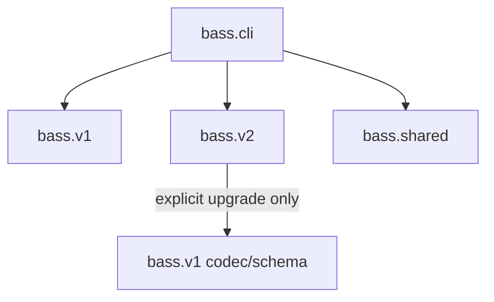

# BASS version boundaries

This document is the source of truth for keeping BASS V1 and BASS V2 separate
inside the same repository.

## Contract matrix

| Contract | V1 | V2 |
|---|---|---|
| Namespace | `bass.v1` | `bass.v2` |
| Schema version | 1 | 2 |
| Scientific genome | 84 binary bits | 10 canonical semantic integers |
| Retired import format | none | 93 binary bits (`bass.v2.legacy93`) |
| Decoded legacy form | 28 integers | none |
| Macro-topology | 3 branches × 3 units | 3 branches × 3 units |
| Unit families | CNN | CNN or attention |
| Attention dependency | forbidden | owned by V2 |
| Canonicalization | canonical decode | skip/repeat normalization plus branch sorting |
| Optimization problem | `bass.v1.problem.BASSProblem` | `bass.v2.problem.BASSProblem` |

## Dependency direction



Rules:

1. `bass.v1` must never import `bass.v2`, `bass.blocks.attention`, or an
   attention primitive.
2. `bass.v2` owns all attention code. Its only V1 import is the explicit
   `upgrade_v1` migration path in `bass.v2.encoding`.
3. `bass.shared` must not know either genotype schema.
4. `Implementation/` maps only to V1 and must reject a 93-bit request.
5. Top-level modules under `src/bass/*.py` are compatibility facades, not the
   implementation location for either version.

## V2 branch semantics

The three branches remain because they are the defining BASS macro-architecture.
They do not have predetermined jobs. Each of the nine units independently
searches one of 43 complete semantic states: skip, or one of 14 valid primitive
configurations with repeat 1-3. Seven configurations are CNN and seven are
attention, so no inactive kernel/window field or primitive-count family prior is
hidden in the encoding.

This permits varied branches without adding a separate branch-type variable.
A branch can be local, contextual, hybrid, or identity-heavy as an emergent
result of its three unit choices.

## The migration boundary

Use only this path to cross versions:

```python
from bass import v1, v2

old = v1.decode(v1_bits)
new = v2.migrate_v1(old)
new_genome = v2.encode(new)
```

The conversion preserves channels and CNN-only status, but it is deliberately
not described as phenotype-exact: V2 uses residual operations and removes
redundant V1 primitives. Use V1 itself whenever exact V1 behavior is required.

There is no implicit V2-to-V1 conversion because an attention phenotype cannot
be represented faithfully in V1.

## Adding code

- A V1 bug fix belongs in `src/bass/v1/` and must retain the 84-bit phenotype.
- A new attention primitive belongs in `src/bass/v2/blocks/`, with registry,
  codec/repair, serialization, shape, and gradient tests under `tests/v2/`.
- Version-neutral evolutionary logic belongs in `src/bass/shared/`.
- Compatibility changes belong in the top-level facades or `Implementation/`;
  they must delegate rather than duplicate either implementation.

The disposition of the independent scientific audit is recorded issue by issue
in [`V2_AUDIT_RESPONSE.md`](V2_AUDIT_RESPONSE.md).

Run the complete gate before merging:

```bash
python -m pytest
ruff check .
ruff format --check .
python -m build
```
