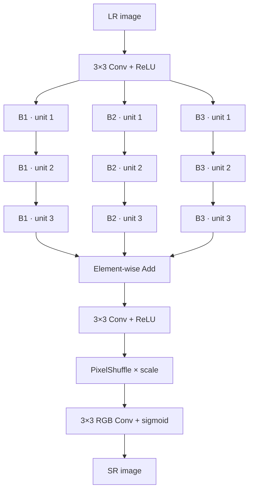

# BASS V1 — frozen CNN-only baseline

> **Status:** implemented, tested, and frozen as the historical BASS baseline.
> Python namespace: `bass.v1`. CLI selector: `--genome-version 1`.

V1 answers the original BASS question: which arrangement of conventional CNN
operations across three parallel branches offers a useful super-resolution
quality–cost trade-off? It intentionally contains no attention primitive and
must not import V2.

## Architecture map



There is no global image skip or bicubic residual path in V1. Each unit applies
its chosen operation `repeat` times; these legacy units are not uniformly
residual.

## Search-space contract

| Dimension | Choices |
|---|---|
| Shared feature width | 16, 32, 48, or 64 channels |
| Branches | 3 |
| Ordered units per branch | 3 |
| Primitive | `conv`, `dil_conv_d2`, `dil_conv_d3`, `dil_conv_d4`, `depthwise_separable_conv`, `inverted_bottleneck_e2`, `conv_transpose`, or `identity` |
| Kernel argument | 1, 3, 5, or 7 where active |
| Repeat count | 1, 2, 3, or 4 where active |
| Upscale factors supported by the builder | ×2, ×3, ×4 |

The scientific chromosome contains 84 bits. It is decoded as 28 three-bit Gray
values: one value selects the shared channel width and each of the nine units
uses three values for operation, kernel, and repetition.

## Representation caveats

V1 is preserved rather than retroactively redesigned:

- modulo decoding permits multiple bit patterns to map to the same choice;
- inactive identity arguments are canonicalized to kernel 1 and repeat 1;
- permutations of the three symmetric branches are not quotiented; and
- the direct sigmoid reconstruction head differs from V2's residual SR head.

These facts matter when comparing search statistics across versions. V1 is the
right contract for reproduction, not the cleanest control space for a new NAS
study.

## Build and inspect V1

```python
import tensorflow as tf

from bass import v1

spec = v1.decode([0] * 84)
model = v1.build_model(spec, upscale_factor=2)
sr = model(tf.zeros((1, 24, 24, 3)), training=False)
assert sr.shape == (1, 48, 48, 3)
```

Request stable taps after all nine units with
`build_model(..., return_feature_model=True)`.

Run the V1 search explicitly:

```bash
bass-search --genome-version 1 --population 20 --generations 10
```

## Implementation map

| Area | Location |
|---|---|
| Frozen constants | [`src/bass/v1/config.py`](../../../src/bass/v1/config.py) |
| 84-bit codec | [`src/bass/v1/encoding.py`](../../../src/bass/v1/encoding.py) |
| Strict phenotype objects | [`src/bass/v1/genotype.py`](../../../src/bass/v1/genotype.py) |
| CNN operation registry | [`src/bass/v1/registry.py`](../../../src/bass/v1/registry.py) |
| TensorFlow model builder | [`src/bass/v1/model_builder.py`](../../../src/bass/v1/model_builder.py) |
| Evaluation/problem | [`src/bass/v1/`](../../../src/bass/v1/) |
| Contract tests | [`tests/v1/`](../../../tests/v1/) |
| Historical facade | [`Implementation/`](../../../Implementation/) |

Return to the [research overview](../../../README.md) or inspect the
[cross-version boundary](../../VERSIONS.md).
