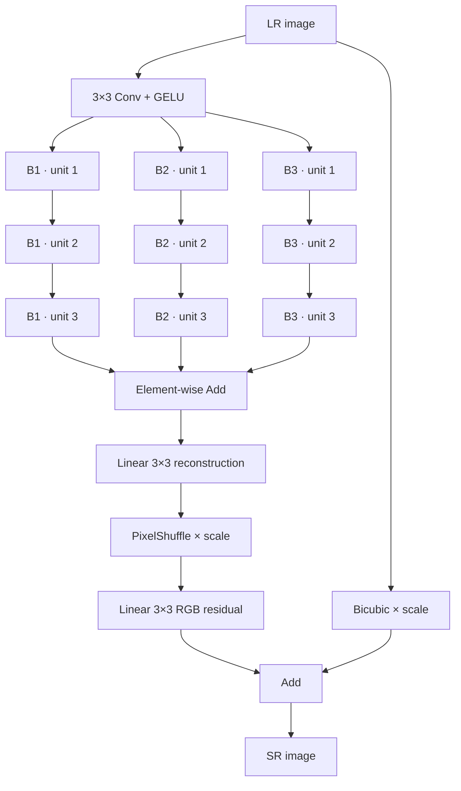

# BASS V2 — optional-attention search space

> **Status:** implemented and structurally audited; full NAS experiments remain
> gated. Python namespace: `bass.v2`. CLI selector: `--genome-version 2`.

V2 asks whether convolution and attention should be chosen at unit level
inside the original three-branch BASS topology. It does not designate a local
branch, a global branch, or an attention branch. Every slot receives the same
catalog, so branch specialization is an outcome of search.

## Architecture map



The residual-over-bicubic head is the scientific default. A direct sigmoid
head remains available only as an explicit ablation via `head_mode="direct"`.
All active V2 primitives are residual; skip is identity.

## Search-space contract

| Dimension | Choices |
|---|---|
| Shared feature width | 16, 32, 48, or 64 channels |
| Branches × unit slots | 3 × 3 |
| Unit state | Skip or one of 14 complete primitive configurations |
| Repeat count for active state | 1, 2, or 3 |
| Window size where active | 4 or 8 |
| Scientific genome | 1 channel ID + 9 complete unit-state IDs |
| Valid state IDs per unit | 43: skip + 14 configurations × 3 repeats |

### Residual CNN configurations

| Primitive | Argument |
|---|---|
| `res_conv` | kernel 3 or 5 |
| `res_dilated_d2` | kernel 3 |
| `res_depthwise_separable` | kernel 3 or 5 |
| `inverted_residual_e2` | kernel 3 or 5 |

### Residual attention configurations

| Primitive | Context mechanism | Argument |
|---|---|---|
| `channel_attention_residual` | Global channel statistics gate a signed feature delta | none |
| `window_transformer` | Local self-attention with convolutional positional encoding | window 4 or 8 |
| `regular_shifted_pair` | Regular then shifted windows guarantee cross-window exchange | window 4 or 8 |
| `hybrid_conv_window` | Depthwise local path combined with window attention | window 4 or 8 |

V2 deliberately avoids full global spatial self-attention, whose memory and
compute scale quadratically with the number of pixels. Shifted-window blocks
apply region and padding masks; arbitrary spatial sizes are padded internally
and cropped back.

## Canonical semantic genome

A V2 scientific genome is a strict list of 10 integers. Each unit ID encodes a
complete meaningful state, so there is no inactive kernel/window field and no
modulo coercion. Before a phenotype enters the population, canonicalization:

1. packs skip states to the end of each branch;
2. normalizes equivalent adjacent repeat groupings; and
3. sorts the three symmetric branch tuples.

Canonical hashes are used for duplicate rejection. Scientific initialization
samples the exhaustive 68,923-state canonical branch catalog directly and uses
a stars-and-bars bijection to sample unordered three-branch multisets exactly
uniformly. It therefore does not inherit the 1–12 raw-preimage multiplicities
identified by the Round-2 audit.

That is representation-uniform, not complexity-uniform. The post-fix 10k audit
averaged 8.9234 active units out of 9 because dense architectures occupy most
of the canonical space. A publication must either justify that prior or freeze
an explicit depth/cost-stratified alternative; it must not call the default
cost-neutral.

Crossover recombines three tokens drawn from the complete six-parent branch
multiset; canonical branch rank is not treated as correspondence. Mutation is
typed and local: repeat, argument, same-family operation, family flip,
insert, delete, and channel moves are logged as attempted transitions by the
optimizer. The retired
93-bit prototype remains available through `bass.v2.legacy93` for explicit
import/export only; it is not a scientific optimizer input.

For an active unit, base move weights are repeat `0.30`, argument `0.20`,
same-family operation `0.20`, family flip `0.15`, and delete `0.15`;
unavailable moves are removed and the remainder renormalized. A selected skip
uses insertion. These are explicit optimizer priors, not empirically optimal
values.

## Build and inspect V2

```python
import tensorflow as tf

from bass import v2

spec = v2.sample(seed=42, attention_probability=0.5)
model = v2.build_model(spec, upscale_factor=4)
sr = model(tf.random.uniform((1, 31, 47, 3)), training=False)
assert sr.shape == (1, 124, 188, 3)
```

`attention_probability` shapes random sampling only. It does not reserve a
branch or constrain the optimizer's mixed phenotypes. It deliberately creates
family-conditioned audit strata and is not the NAS initializer. The optimizer
uses `v2.sample_canonical_genome()` by default.

Request stable taps after all nine units with
`build_model(..., return_feature_model=True)`. Pair them with
`v2.feature_tap_metadata(spec)` when comparing proxies; the metadata exposes
primitive, repeat, cumulative depth, and internal attention-block count.

Run the V2 search explicitly:

```bash
bass-search --genome-version 2 --population 20 --generations 10
```

V1 migration is explicit and not phenotype-exact:

```python
from bass import v1, v2

v1_spec = v1.decode([0] * 84)
v2_spec = v2.migrate_v1(v1_spec)
assert v2_spec.attention_fraction == 0.0
```

## Scientific readiness gates

Executable code is not evidence that a NAS formulation is scientifically
useful. Before full V2 claims, the project requires:

1. unit and version-boundary tests;
2. a one-million-draw qualifying structural audit (10k remains preflight);
3. a 500-model family-stratified build/gradient validation;
4. family-balanced proxy calibration against trained outcomes;
5. short-training rank validation; and
6. a dry-run of the complete multi-objective search.

The issue-by-issue decision and commands live in
[`docs/V2_AUDIT_RESPONSE.md`](../../V2_AUDIT_RESPONSE.md). Passing the first
three gates does not substitute for proxy calibration or SR benchmarking.
The subsequent Round-2 disposition is recorded in
[`docs/ROUND2_AUDIT_RESPONSE.md`](../../ROUND2_AUDIT_RESPONSE.md).
The exact 14-gate dependency graph, hardware profiles, work orders, and result
contracts live in [`experiments/`](../../../experiments/README.md). No
qualifying hardware gate is recorded yet.

## Implementation map

| Area | Location |
|---|---|
| Frozen catalog | [`src/bass/v2/config.py`](../../../src/bass/v2/config.py) |
| Semantic codec | [`src/bass/v2/encoding.py`](../../../src/bass/v2/encoding.py) |
| Canonical phenotype | [`src/bass/v2/genotype.py`](../../../src/bass/v2/genotype.py) |
| Operation registry | [`src/bass/v2/registry.py`](../../../src/bass/v2/registry.py) |
| CNN/attention blocks | [`src/bass/v2/blocks/`](../../../src/bass/v2/blocks/) |
| TensorFlow model builder | [`src/bass/v2/model_builder.py`](../../../src/bass/v2/model_builder.py) |
| Evaluation/problem | [`src/bass/v2/`](../../../src/bass/v2/) |
| Semantic variation | [`src/bass/v2/variation.py`](../../../src/bass/v2/variation.py) |
| Contract tests | [`tests/v2/`](../../../tests/v2/) |
| Audit harnesses | [`scripts/`](../../../scripts/) |
| Qualifying experiment protocol | [`experiments/`](../../../experiments/README.md) |

Return to the [research overview](../../../README.md) or inspect the
[cross-version boundary](../../VERSIONS.md).
