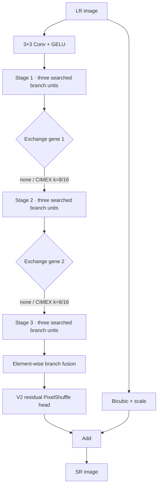

# BASS V3 — IBASS with optional CIMEX exchange

> **Status:** stage-aware runtime implemented; structural and numerical software
> tests pass; publication-scale NAS remains experiment-gated. Python namespace: `bass.v3`.
> CLI selector: `--genome-version 3`.

BASS V3 extends the original branching search question along one new axis:
**should the three searched branches exchange compact information before final
fusion?** Interaction-aware BASS (IBASS) retains the stem, three branches,
three ordered stages, element-wise fusion, and residual SR head of V2. It adds
two optional, searchable Consensus–Innovation Memory Exchange (CIMEX) sites.

This is an implementation of a falsifiable research hypothesis, not evidence
that CIMEX improves PSNR or establishes state of the art.

## Architecture map



Every stage still makes three independent V2-compatible unit choices. An
enabled exchange jointly updates all three feature tensors before the following
stage. There is deliberately no exchange immediately before final addition:
CIMEX centers its three corrections, so such a site would cancel exactly.
Canonicalization removes an earlier exchange only when all downstream branch
transforms are skips. It does so after preserving stage barriers; it never moves
a downstream transform to the other side of CIMEX first.

## CIMEX primitive

For branch features (F_b \in \mathbb{R}^{H \times W \times C}), CIMEX first
separates consensus from branch-specific innovation:

\[
C = \frac{1}{3}\sum_{b=1}^{3}F_b,
\qquad
D_b = F_b - C.
\]

Each innovation produces a compact content-dependent prototype memory:

\[
A_b = \operatorname{softmax}_{HW}(Q(D_b)),
\qquad
M_b = A_b^{\top}V(D_b),
\qquad M_b \in \mathbb{R}^{k \times d}.
\]

Branch (b) reads the mean memory of the *other* two branches, conditioned on
its own feature and the consensus. Reads are centered across branches before a
shared residual projection:

\[
\widehat{R}_b = R_b - \frac{1}{3}\sum_{j=1}^{3}R_j,
\qquad
F'_b = F_b + \tanh(\alpha)H(\widehat{R}_b).
\]

The implementation uses shared projections and (k \in \{8,16\}), giving an
approximately (O(3HWk)) exchange rather than global spatial attention's
quadratic (O((HW)^2)) affinity matrix. Real FLOPs, latency, and peak memory
must still be profiled.

### One deliberate correction to the original proposal

An exactly zero gate would make enabled CIMEX variables invisible to the
current gradient-flow proxy while still charging their parameter/FLOP cost.
That would bias NAS against exchange before it could be evaluated. Enabled
CIMEX therefore starts near identity with an effective gate of `0.01`, stored
through a float32 `atanh` parameter. The exact V2 subspace is represented
honestly by the searchable `none` state—not by pretending enabled CIMEX is V2.

This is a falsifiable choice, not a sacred constant. The qualifying primitive
gate tests the explicit `alpha=0` identity boundary without demanding impossible
projection gradients there, and CIMEX ablation A07 compares zero against the
released small nonzero initialization under matched training.

## Search contract

The strict scientific genome contains 12 semantic integers:

| Gene range | Meaning |
|---|---|
| 1 integer | Shared channel-width ID |
| 9 integers | Complete V2-compatible branch/stage unit states |
| 2 integers | Exchange after stage 1 and stage 2 |

Each exchange gene is one complete state: `none`, `cimex_k8`, or
`cimex_k16`. No kernel, window, prototype, or enable field is conditionally
inactive.

Default NAS initialization is exactly uniform over complete corrected V3
architectures. Branch catalogs are generated separately for the four enabled
exchange masks because each mask defines a different safe equivalence relation.
The exact corrected space contains `2,643,101,795,040,984` architectures across
the four widths. Passing an explicit `exchange_probability` requests a
hierarchical prior: enablement is sampled first and branch multisets are uniform
within that barrier mask.

The corrected complete-canonical prior is intentionally not exchange-neutral:

| Enabled CIMEX sites | Exact architectures | Probability |
|---:|---:|---:|
| 0 | 218,283,124,749,400 | 8.2586% |
| 1 | 1,084,538,018,126,640 | 41.0328% |
| 2 | 1,340,280,652,164,944 | 50.7086% |

Thus 91.7414% of initial candidates use at least one CIMEX site under this
prior. That is mathematically uniform over architectures, not neutral between
mechanisms. The qualifying V3 search gate compares it against an
exchange-neutral prior, a complexity-stratified prior, and a one-factor
exchange-mutation sensitivity condition.

Uniform canonical sampling removes representation multiplicity; it does not
flatten depth or cost. Because the unit subspace is combinatorially dense,
complexity-stratified initialization remains a study decision rather than a
property silently attributed to this sampler.

### Stage-aware canonicalization

V3 uses representation `interaction-semantic-v2`. An enabled exchange is a
hard boundary:

```text
Stage 1 | CIMEX | Stage 2
```

Skips may be packed and adjacent equal operations may be repeat-compressed only
inside a boundary-delimited segment. If a site is `none`, compression may cross
that inactive boundary and exactly recovers V2 semantics. The three complete
branches remain permutation-quotiented because shared CIMEX projections are
branch-permutation equivariant.

This distinction is material. `[skip, A, skip]` with CIMEX after Stage 1 keeps
`A` after CIMEX; likewise `A×1 | CIMEX | A×2` cannot become
`A×3 | CIMEX`. Exchange removal and branch normalization are solved jointly to
a fixed point.

The earlier `interaction-semantic-v1` identifier is rejected explicitly. Its
enabled-CIMEX hashes cannot be migrated faithfully because the old quotient may
already have discarded the intended stage position. No qualifying result was
recorded under that representation.

Variation respects branch symmetry:

- crossover draws three branch tokens from the unordered six-parent multiset;
- unit mutation distinguishes repeat, argument, operation, family flip,
  insert, and delete moves;
- exchange mutation distinguishes insertion, deletion, and prototype changes;
  and
- attempted transition counts—including duplicate-rejected proposals—are
  stored in the evolutionary history.

Enabled exchange mutation uses prototype-change/delete base weights `0.60/0.40`;
a selected `none` state inserts `k=8` or `k=16` uniformly. These weights are a
declared baseline and should be sensitivity-tested rather than treated as a
theoretical optimum.

## Exact V2 extension boundary

With both exchanges set to `none`, V3 delegates model construction to the V2
builder. For the same architecture and seed, the graph name, parameter count,
weights, and numerical output match V2 exactly. Migration is explicit:

```python
from bass import v2, v3

base = v2.sample(seed=17, attention_probability=0.5)
extended = v3.migrate_v2(base)
assert not extended.uses_cimex
assert v3.to_v2(extended) == base
```

Projecting an enabled-CIMEX architecture back to V2 raises instead of silently
discarding interaction.

## Build and run IBASS

```python
import tensorflow as tf

from bass import v3

spec = v3.sample(
    seed=42,
    attention_probability=0.5,
    exchange_probability=1.0,
)
model = v3.build_model(spec, upscale_factor=4)
sr = model(tf.random.uniform((1, 31, 47, 3)), training=False)
assert sr.shape == (1, 124, 188, 3)
```

`v3.sample(...)` is the family-conditioned construction helper used for
controlled strata. The optimizer uses `v3.sample_canonical_genome()`.

Run a small search smoke test:

```bash
bass-search --genome-version 3 --population 4 --generations 1 \
  --input-size 16 --skip-flops
```

Omit `--exchange-probability` for the uniform canonical prior. Supplying a
number in `[0,1]` intentionally conditions the probability of enabled active
sites.

Stable unit taps are returned by
`build_model(..., return_feature_model=True)`. Use
`v3.feature_tap_metadata(spec)` to see each primitive, repeat count, cumulative
depth, internal attention-block count, and the exchange immediately after that
pre-exchange tap.

## What is tested versus what remains unknown

| Question | Current status |
|---|---|
| Strict 12-integer codec and canonical hashes | Tested |
| Enabled CIMEX boundaries preserve stage and repeat position | Exhaustively tested over all one-branch states |
| Corrected branch catalogs and exact V3 cardinality | Tested |
| Algebraically inactive exchange removal | Tested |
| V2 `none/none` graph, weights, and output equality | Tested |
| CIMEX tensor shape, finite gradients, branch-sum conservation | Tested |
| Branch-permutation equivariance | Tested |
| Dynamic non-divisible spatial sizes and scales 2/3/4 | Tested |
| Mixed precision and Keras save/load | Tested |
| Direct canonical sampling, semantic crossover/mutation | Tested |
| 1M qualifying structural audit | Harness implemented; qualifying run pending |
| 500-model executable gate | Harness implemented; full frozen-revision run pending |
| Real FLOPs, latency, and peak accelerator memory | Pending |
| Proxy-to-short-training rank calibration | Pending |
| CIMEX matched-cost mechanism/site/prototype ablations | Pending |
| Standard SISR training and benchmark evidence | Pending |
| Novelty or SoTA claim | **Not established** |

Run local preflight harnesses explicitly:

```bash
python scripts/audit_v3_stage_equivalence.py --samples 10000 --seed 42
python scripts/audit_v3_space.py --samples 10000 --seed 42
python scripts/validate_v3_models.py --samples 500 --seed 42 \
  --input-size 16 --scale 2
```

Direct harness output is preflight, not a qualifying PASS. The complete
14-gate dependency graph, required hardware, immutable work orders, result
contracts, and staged CIMEX ablations live in
[`experiments/`](../../../experiments/README.md). No qualifying hardware gate
is recorded yet.

## Soundness and novelty boundary

CIMEX combines known ingredients—branch interaction, content-dependent token
aggregation, residual gating, and centered diversity preservation. The
candidate contribution is their searchable, permutation-equivariant,
V2-exact integration into BASS. It may still fail because centering can remove
useful common updates, prototypes can discard fine texture, shared weights can
limit specialization, or search proxies can favor cheaper independent paths.

Relevant prior-art boundaries include:

- [DIIN](https://guangweigao.github.io/paper/24-TIM-DIIN.pdf), explicit CNN–Transformer interaction in SR;
- [CATANet (CVPR 2025)](https://openaccess.thecvf.com/content/CVPR2025/html/Liu_CATANet_Efficient_Content-Aware_Token_Aggregation_for_Lightweight_Image_Super-Resolution_CVPR_2025_paper.html), content-aware token aggregation;
- [ATD](https://arxiv.org/abs/2401.08209), token dictionaries for efficient Transformer SR;
- [ESC](https://arxiv.org/abs/2503.06671), efficient convolution–attention coupling for restoration; and
- [RegisterBridgeMM](https://arxiv.org/abs/2608.04833), register-mediated branch exchange outside SISR.

This is a starting boundary, not proof of novelty. A paper must update the
systematic search and compare mechanisms under matched protocols.

## Implementation map

| Area | Location |
|---|---|
| Frozen V3 contract | [`src/bass/v3/config.py`](../../../src/bass/v3/config.py) |
| 12-gene codec and canonical sampler | [`src/bass/v3/encoding.py`](../../../src/bass/v3/encoding.py) |
| IBASS phenotype | [`src/bass/v3/genotype.py`](../../../src/bass/v3/genotype.py) |
| CIMEX layer | [`src/bass/v3/blocks/cimex.py`](../../../src/bass/v3/blocks/cimex.py) |
| Semantic variation | [`src/bass/v3/variation.py`](../../../src/bass/v3/variation.py) |
| Model builder | [`src/bass/v3/model_builder.py`](../../../src/bass/v3/model_builder.py) |
| Evaluation/problem | [`src/bass/v3/`](../../../src/bass/v3/) |
| Contract tests | [`tests/v3/`](../../../tests/v3/) |
| Structural/executable gates | [`scripts/audit_v3_space.py`](../../../scripts/audit_v3_space.py), [`scripts/validate_v3_models.py`](../../../scripts/validate_v3_models.py) |
| Stage-equivalence preflight | [`scripts/audit_v3_stage_equivalence.py`](../../../scripts/audit_v3_stage_equivalence.py) |
| Qualifying experiment protocol | [`experiments/`](../../../experiments/README.md) |

The critical Round-3 representation finding and experiment-layer dispositions
are reconciled in [`docs/ROUND3_AUDIT_RESPONSE.md`](../../ROUND3_AUDIT_RESPONSE.md).
The Round-2 disposition remains in
[`docs/ROUND2_AUDIT_RESPONSE.md`](../../ROUND2_AUDIT_RESPONSE.md). Return to the
[research overview](../../../README.md) or inspect the
[cross-version boundary](../../VERSIONS.md).
