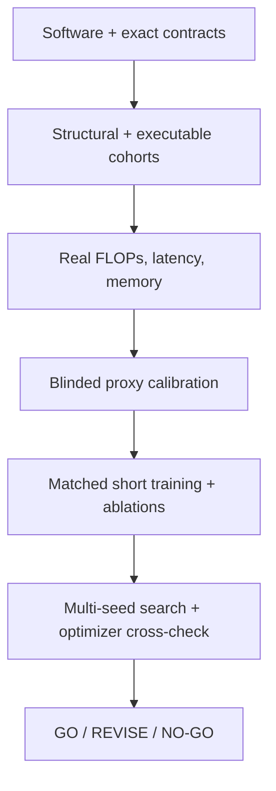

# BASS V2/V3 experimental gates

This directory is the execution hand-off for the experiments that cannot be
honestly completed on a generic development machine. The protocols are frozen,
machine-readable, hardware-aware, and **not yet run**. Their current scientific
state is `DEFINED_NOT_RUN`, so neither V2 nor V3 is presented as validated or
state of the art.

## The rule that matters

A green unit test proves software behavior. It does not prove proxy validity,
training quality, deployment efficiency, search stability, novelty, or SoTA.
A smoke run, dirty source tree, incomplete cohort, wrong accelerator, dropped
OOM, or post-hoc threshold change can never become a qualifying PASS.

The canonical manifests are packaged at:

- [`gates-v2.json`](../src/bass/experiments/protocols/gates-v2.json): 14 gates
  from software contracts through full-NAS authorization;
- [`gates-v3.json`](../src/bass/experiments/protocols/gates-v3.json): 13 gates
  covering exact V2 embedding, CIMEX invariants, cost, ablations, SR evidence,
  search, and research authorization;
- [`hardware.json`](../src/bass/experiments/protocols/hardware.json): qualifying
  CPU, single-GPU, target-device, and multi-GPU profiles; and
- [`result-contracts.json`](../src/bass/experiments/protocols/result-contracts.json):
  immutable result envelopes and external adapter outputs.

## Gate flow



V2 and V3 share this evidence ladder, but V3 adds the exact-V2-subspace and
CIMEX causal-ablation obligations. Gates may run in parallel only when their
declared dependencies permit it.

## Inspect and prepare work

Install the development package, then inspect the frozen plan:

```bash
bass-gates list
bass-gates show v2 V2-G03
bass-gates show v3 V3-G08
```

Prepare a work order for the machine that will execute it:

```bash
bass-gates prepare v3 V3-G06 \
  --output runs/v3-g06/work-order.json \
  --parameter target_device=NVIDIA_L4 \
  --parameter input_size=256 \
  --parameter batch_size=1 \
  --slurm runs/v3-g06/job.slurm
```

The work order records the protocol digest, current source revision, dirty-tree
state, required hardware, exact criteria, and expected artifacts. A work order
created with `--smoke` is useful for plumbing but is permanently nonqualifying.

The generated Slurm file is intentionally a safe template, not a guessed
cluster configuration. Replace `${BASS_*_RUNNER}` variables with the laboratory
runner that implements the corresponding contract, then keep the expanded
command and environment in the result manifest.

## Local preflight harnesses

These repository-native harnesses catch structural/model failures before scarce
hardware is scheduled:

```bash
python scripts/audit_v2_space.py --samples 1000000 --output structural-v2.json
python scripts/validate_v2_models.py --samples 500 --output executable-v2.json
python scripts/audit_v3_space.py --samples 1000000 --output structural-v3.json
python scripts/validate_v3_models.py --samples 500 --output executable-v3.json
```

Their reports are preflight evidence. A qualifying gate additionally needs the
frozen cohort, work order, observed hardware, raw adapter records, hashes, and
result envelope specified by the protocol. Running a script directly does not
silently manufacture those artifacts or a PASS.

Profiling, memory isolation, matched SR training, and cluster-scale NAS remain
external adapters because dataset storage, scheduler, accelerator accounting,
and deployment target belong to the execution environment. Their inputs and
outputs are nevertheless fixed by
[`RESULT_CONTRACTS.md`](RESULT_CONTRACTS.md); “external” does not mean
unspecified.

## Decisions deliberately not automated

- There is no universal “good” proxy correlation. The useful rank/stability
  thresholds must be justified and frozen before trained outcomes are unblinded.
- `|Spearman(Params, FLOPs)| >= 0.95` is a redundancy-review trigger, not an
  automatic reason to delete an objective.
- There is no universal memory budget. The target device, input, batch, and
  precision define it.
- A CIMEX pair is called matched-cost only when **both** Params and FLOPs differ
  by at most 5%; otherwise it is labeled unmatched and cost enters the model.
- V3 is not accepted because CIMEX is new-looking. It must improve a held-out
  quality–compute–latency–memory Pareto comparison under matched training.

## Execution ledger

No qualifying result is committed yet:

| Version | Protocol | Defined | Qualifying gates passed | Decision |
|---|---|---:|---:|---|
| V2 | `bass-v2-gates-1.0` | Yes | 0 / 14 | **NO-GO pending execution** |
| V3 | `bass-v3-gates-1.0` | Yes | 0 / 13 | **NO-GO pending execution** |

Do not edit this table from an informal run. Validate result envelopes, retain
failed cases and deviations, and update the ledger only through the final
decision gate.
